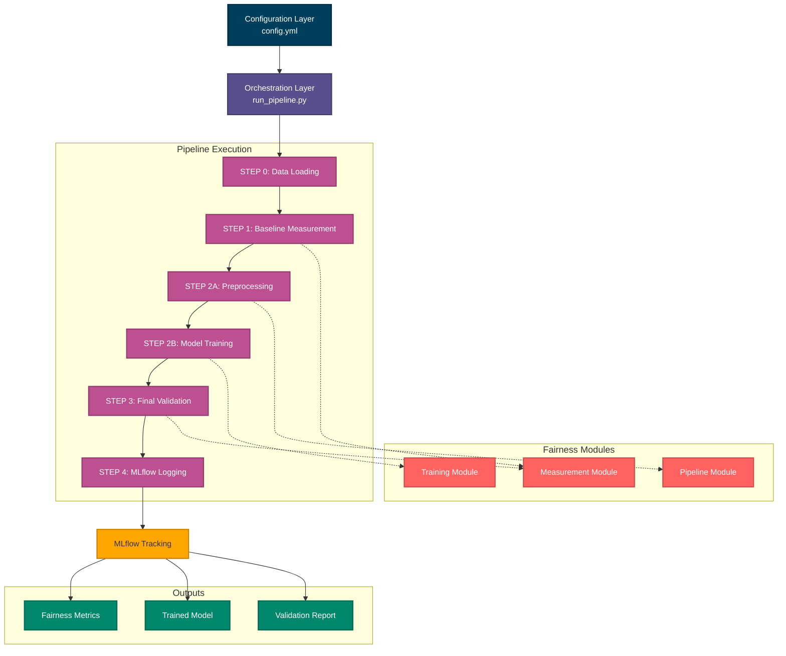

# Fairness Pipeline Development Toolkit

A production-ready system for building, deploying, and maintaining fair AI systems in high-stakes domains.

## Repository

[https://github.com/fairml-consulting/fairness-pipeline-toolkit](https://github.com/fairml-consulting/fairness-pipeline-toolkit)

## Overview

The Fairness Pipeline Development Toolkit provides an integrated system that orchestrates fairness-aware machine learning workflows from development to deployment. It addresses the challenge of inconsistent, ad-hoc fairness practices by providing a standardized, reproducible, and scalable solution.

### Target Audience

This toolkit is designed for:
- Machine learning engineers deploying models in regulated environments
- Data scientists operationalizing fairness experiments
- Platform teams standardizing fairness practices across projects
- Organizations requiring auditable, reproducible fairness workflows

### Problem Statement

Organizations struggle with:
- Inconsistent fairness practices across different teams and projects
- Manual, time-consuming fairness audits and interventions
- Lack of reproducibility in fairness experiments
- Difficulty scaling fairness best practices organization-wide
- No automated validation of fairness improvements

### Solution

This toolkit provides:
- Declarative configuration via YAML for complete pipeline control
- Automated orchestration of measurement, preprocessing, and training
- Integrated fairness modules working seamlessly together
- MLflow tracking for complete experiment reproducibility
- Before/after validation with clear success criteria

## Architecture

### System Design




### Module responsibilities

| Module | Responsibility | Location |
|--------|---------------|----------|
| **DataLoader** | Load datasets and create train/test splits | `src/data_loader.py` |
| **BaselineMeasurement** | Quantify bias in raw data | `src/baseline_measurement.py` |
| **PreprocessingPipeline** | Transform data to reduce bias | `src/preprocessing.py` |
| **ModelTrainer** | Train models with fairness constraints | `src/model_trainer.py` |
| **FinalValidator** | Validate fairness and performance | `src/final_validator.py` |
| **MLflowLogger** | Track experiments and artifacts | `src/mlflow_logger.py` |
| **PipelineOrchestrator** | Coordinate all modules | `src/run_pipeline.py` |

## Installation

### Prerequisites

- Python 3.11 or higher
- Poetry package manager (recommended) or pip
- Git

### Step 1: Clone repository

```bash
git clone https://github.com/fairml-consulting/fairness-pipeline-toolkit.git
cd fairness-pipeline-toolkit
```

### Step 2: Install dependencies

#### Using poetry (Recommended)

```bash
poetry install
poetry shell
```

#### Using pip

```bash
python -m venv venv
source venv/bin/activate  # On Windows: venv\Scripts\activate
pip install -r requirements.txt
```

### Step 3: Verify installation

```bash
python -c "from src.run_pipeline import PipelineOrchestrator; print('Installation successful')"
```

## Quick start

### 1. Prepare your data

Place your dataset in the `data/` directory. The toolkit expects a CSV file with:
- A target column (binary classification)
- Protected attributes (e.g., gender, race, age_group)
- Feature columns

Example dataset structure:
```csv
loan_amount,income,credit_score,gender,race,age_group,loan_approved
50000,75000,680,Female,Group_A,31-50,1
30000,45000,720,Male,Group_B,18-30,1
...
```

### 2. Configure pipeline

Edit `config.yml` to specify your data source and fairness requirements:

```yaml
data:
  path: "data/your_dataset.csv"
  target_column: "your_target"
  protected_attributes:
    - "gender"
    - "race"
```

### 3. Run pipeline

```bash
python src/run_pipeline.py --config config.yml
```

### 4. View results

```bash
mlflow ui --port 5000
```

Open http://localhost:5000 in your browser.

## Testing

### Run unit tests

```bash
poetry run pytest tests/
```

### Run with coverage

```bash
poetry run pytest --cov=src --cov-report=html
```

View coverage report by opening `htmlcov/index.html`.

## Project structure

```
fairness-pipeline-toolkit/
├── src/
│   ├── run_pipeline.py         # Main orchestrator
│   ├── config_models.py        # Pydantic configuration models
│   ├── data_loader.py          # Data loading module
│   ├── baseline_measurement.py # Baseline fairness measurement
│   ├── preprocessing.py        # Data preprocessing
│   ├── model_trainer.py        # Model training
│   ├── final_validator.py      # Final validation
│   └── mlflow_logger.py        # MLflow integration
├── tests/
│   ├── test_data_loader.py
│   ├── test_preprocessing.py
│   └── test_model_trainer.py
├── data/                       # Dataset directory
├── docs/                       # Additional documentation
├── examples/                   # Example notebooks
├── config.yml                  # Main configuration file
├── pyproject.toml             # Poetry dependencies
└── README.md                  # This file
```

## Best practices

### 1. Configuration management

- Version control your `config.yml` files
- Create separate configs for different experiments
- Document configuration choices in git commit messages

### 2. Experimentation

- Always run baseline experiments first
- Test one change at a time
- Use MLflow to track all experiments systematically

### 3. Data privacy

- Never commit real data to version control
- Use the `.gitignore` file to exclude data directories
- Anonymize sensitive attributes when possible

### 4. Production Deployment

- Validate fairness on holdout data before deployment
- Monitor fairness metrics in production
- Have clear rollback criteria

## Troubleshooting

### Module import errors

Ensure you're in the project root directory and have activated your virtual environment.

### MLflow connection issues

Start MLflow UI with:
```bash
mlflow server --backend-store-uri sqlite:///mlflow.db --default-artifact-root ./mlruns
```

### Configuration validation errors

The toolkit uses Pydantic for configuration validation. Check error messages for specific validation failures.

## Contributing

Contributions are welcome! Please:
1. Fork the repository
2. Create a feature branch
3. Add tests for new functionality
4. Ensure all tests pass
5. Submit a pull request

## License

MIT License - see LICENSE file for details.

## Citation

If you use this toolkit in your research, please cite:

```bibtex
@software{fairness_pipeline_toolkit,
  title = {Fairness Pipeline Development Toolkit},
  author = {FairML Consulting},
  year = {2026},
  url = {https://github.com/fairml-consulting/fairness-pipeline-toolkit}
}
```

## Support

For issues and questions:
- GitHub Issues: https://github.com/fairml-consulting/fairness-pipeline-toolkit/issues
- Documentation: See `docs/` directory
